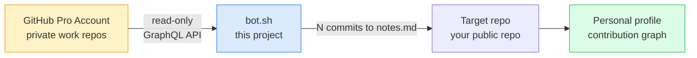
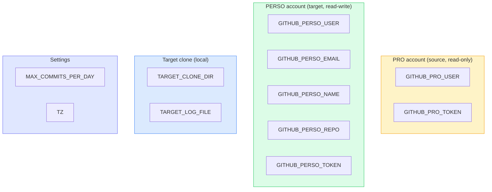
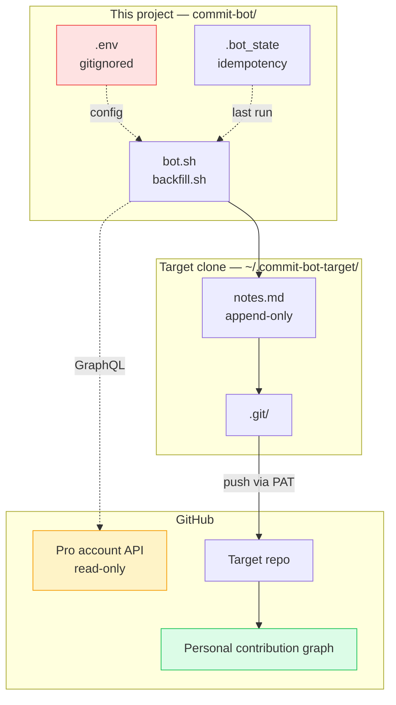

# commit-bot

[](LICENSE)
[](https://www.gnu.org/software/bash/)
[]()
[]()

> Generate organic GitHub contribution activity — without faking it daily.

<p align="center">
  
</p>

A lightweight Bash toolkit that turns your personal GitHub profile into an honest, organic reflection of your real coding activity — including the parts that happen on private work accounts.

---

## Table of contents

- [Why this exists](#why-this-exists)
- [How it works](#how-it-works)
- [The scripts](#the-scripts)
- [Quick start](#quick-start)
- [Configuration reference](#configuration-reference)
- [Generating GitHub tokens](#generating-github-tokens)
- [Scheduling with cron](#scheduling-with-cron)
- [Architecture](#architecture)
- [Caveats](#caveats)
- [Credits](#credits)

---

## Why this exists

Most GitHub commit bots make your contribution graph **look like a lie**: a perfect green wall, every single day, including holidays. Nobody codes like that.

This project takes a different approach:

```
  Real activity   →   Organic-looking graph
  No activity     →   Honest blank squares
  Private work    →   Mirrored anonymously on your public profile
```

If you spend most of your time committing to a private work account, your personal profile shouldn't look empty. But it also shouldn't lie about days you didn't work.

---

## How it works



The bot reads only **contribution counts** from your work account — never commit content, code, or repo names. Just the daily activity number that's already publicly visible on the work account's contribution graph.

### Two-repo architecture

This project (`commit-bot`) holds the **tooling** — scripts, config, README.
The **target repo** (where commits land) is **separate**, defined by `GITHUB_PERSO_REPO` in `.env`. The bot clones the target locally to `~/.commit-bot-target/`, appends to a single file (`notes.md` by default), commits, and pushes.

**The target repo's README is never touched.** Safe to use your profile repo as the target without destroying your profile bio.

---

## The scripts

| Script | Purpose | When it runs | Output |
|---|---|---|---|
| [`bot.sh`](bot.sh) | Reads today's contribution count from a secondary GitHub account and replicates it on the target repo | Cron, e.g. 23:00 daily | N commits/day (N = pro account's contribution count, capped) |
| [`backfill.sh`](backfill.sh) | One-shot: replays historical contributions onto the target repo with their **original dates** | Manual, after setup | Bulk fill of past N months |

Recommended setup: `bot.sh` on cron (forward-looking, automated) plus a one-time `backfill.sh` run to fill in history.

---

## Quick start

### 1. Clone

```bash
git clone https://github.com/<your-username>/commit-bot.git
cd commit-bot
```

### 2. Install dependencies

```bash
# macOS
brew install jq

# Debian/Ubuntu
sudo apt install jq
```

`git`, `curl`, and `bash` are usually already installed.

### 3. Prepare a target repo

Pick (or create) an existing public repo on your personal GitHub account where you want the bot to land commits.

Examples:
- A dedicated repo like `daily-log` or `journal`
- Your profile repo (`<username>/<username>`) — only safe because the bot **never touches the README**

The target repo must be **non-empty** (must have at least one commit on its default branch — a single `README.md` is enough).

### 4. Configure

```bash
cp .env.example .env
$EDITOR .env
```

Fill in:
- Your work GitHub username and token
- Your personal GitHub username, verified email, name, target repo name, and token
- Your IANA timezone

See [Configuration reference](#configuration-reference) below for details.

### 5. Test

```bash
./bot.sh
```

On the first run, the script clones the target repo to `~/.commit-bot-target/`, then queries the API. If you have contributions today, it generates the commits and pushes. If not, it exits cleanly.

### 6. (Optional) Backfill history

```bash
./backfill.sh --from 2025-05-28 --to 2026-05-27
```

### 7. Schedule the daily run

See [Scheduling with cron](#scheduling-with-cron).

---

## Configuration reference

All settings live in `.env` (gitignored, never committed). Structure follows `.env.example`:



| Variable | Required | Purpose |
|---|---|---|
| `GITHUB_PRO_USER` | yes | Work GitHub username |
| `GITHUB_PRO_TOKEN` | yes | PAT for the work account (read-only scopes) |
| `GITHUB_PERSO_USER` | yes | Personal GitHub username |
| `GITHUB_PERSO_EMAIL` | yes | Email verified on your personal account |
| `GITHUB_PERSO_NAME` | no | Display name for commits (wrap in quotes if it contains spaces) |
| `GITHUB_PERSO_REPO` | yes | **Target repo name** that will receive the commits |
| `GITHUB_PERSO_TOKEN` | yes | PAT for the personal account (write scope on the target repo) |
| `TARGET_CLONE_DIR` | no (default `~/.commit-bot-target`) | Local directory where the target repo is cloned |
| `TARGET_LOG_FILE` | no (default `notes.md`) | File in the target repo that the bot appends to |
| `MAX_COMMITS_PER_DAY` | no (default `10`) | Cap on mirrored commits per day |
| `TZ` | no (default `Africa/Lome`) | IANA timezone — must match your GitHub profile's timezone |

---

## Generating GitHub tokens

You need **two Personal Access Tokens** — one per account. Use **classic tokens** for simplicity.

### Token A — Work account (read-only)

1. Sign in as your work user
2. Open https://github.com/settings/tokens
3. Click **Generate new token (classic)**
4. Note: `commit-bot — read only`
5. Expiration: 90 days recommended
6. Scopes:
   - `read:user` (always)
   - `repo` *(only if your work commits are in private repos)*
7. Copy the token immediately — shown only once

### Token B — Personal account (write)

1. Sign out, then sign back in as your personal user (incognito helps)
2. Open https://github.com/settings/tokens
3. Click **Generate new token (classic)**
4. Note: `commit-bot — push perso`
5. Expiration: 90 days recommended
6. Scope:
   - `public_repo` *(if the target repo is public)*
   - or `repo` *(if the target repo is private)*
7. Copy the token

Paste both tokens into your `.env`.

---

## Scheduling with cron

Edit your crontab:

```bash
crontab -e
```

Add (use absolute paths — `~` does not expand in cron):

```cron
# Daily mirror at 23:00 (only runs if your machine is on at that time)
0 23 * * * /bin/bash /absolute/path/to/commit-bot/bot.sh >> /absolute/path/to/commit-bot/bot.log 2>&1
```

Verify with:

```bash
crontab -l
```

### macOS note

Recent macOS versions sandbox cron. If you see `Operation not permitted` errors in `bot.log`, grant **Full Disk Access** to `/usr/sbin/cron` (or `/bin/bash`) under **System Settings → Privacy & Security**.

---

## Architecture



### File layout

```
commit-bot/
├── bot.sh              # Daily sync of work account activity
├── backfill.sh         # One-shot historical replay
├── .env                # Secrets (gitignored)
├── .env.example        # Template
├── .bot_state          # Last successful run (gitignored)
├── .gitignore
├── LICENSE
├── README.md
└── the-dream.png

~/.commit-bot-target/   # Clone of the target repo (separate location)
├── README.md           # Target repo's README — NEVER touched by the bot
├── notes.md            # Target log file — where bot appends one line per commit
└── .git/
```

### Why a separate clone

Keeping the target repo's working tree in a different location guarantees:

1. The bot can never accidentally touch your `commit-bot` project files.
2. The target repo's README (which may be your public profile page, e.g. `<user>/<user>`) stays pristine. The bot only writes to `notes.md`.
3. You can safely run the bot from cron without worrying about which directory the user is in.

### How `backfill.sh` preserves dates

For each historical day, the script sets `GIT_AUTHOR_DATE` and `GIT_COMMITTER_DATE` to a synthetic timestamp on that day, spread across working hours (09:00–21:00):

```bash
GIT_AUTHOR_DATE="2025-08-14T14:08:28-0400" \
GIT_COMMITTER_DATE="2025-08-14T14:08:28-0400" \
git commit -m "chore: routine maintenance"
```

GitHub uses the **author date** to place dots on the contribution graph, so backfilled commits land on their original calendar day.

---

## Caveats

### Forks don't count

GitHub does not count commits to forked repos on your contribution graph. If your target repo is a fork, you must either detach it (Settings → Danger Zone → Leave fork network) or use a non-fork repo.

### Employer policies

Mirroring your work activity onto a public profile can implicitly reveal your work intensity, vacation days, and weekend habits. Some employment contracts restrict disclosing this kind of data, even in aggregate. Check your contract or talk to your manager before enabling the mirror.

### GitHub Terms of Service

Reading your own data via the API using your own token is sanctioned use. Generating commits to game contribution graphs is a grey area: GitHub doesn't formally prohibit it, but extreme volumes (thousands of commits per push) may be flagged by anti-abuse heuristics. The `MAX_COMMITS_PER_DAY` cap exists partly to keep things plausible.

### What this does NOT do

- It does **not** copy code, commit messages, file names, or any other content from your work commits.
- It does **not** access your work repos beyond reading aggregate contribution counts.
- It does **not** require your personal account to be a member of your work organisation.

### Token hygiene

- Tokens in `.env` are local-only and gitignored.
- The push URL embeds the token at runtime but never persists it in `.git/config`.
- Rotate tokens every 90 days.
- If a token leaks, revoke it immediately at https://github.com/settings/tokens.

### Time zones

GitHub places contributions according to the **profile's configured time zone**, not UTC. Make sure `TZ` in `.env` matches your GitHub profile setting (https://github.com/settings, "Contribution graphs" section).

---

## Credits

Maintained by **Kokou DENYO** ([@EmD-228](https://github.com/EmD-228)).

Built on top of the original commit-bot by **Steven Kneiser** ([@theshteves](https://github.com/theshteves/commit-bot)) — MIT licensed.

This fork rewrites the daily script to mirror real activity from a secondary GitHub account, adds a one-shot historical backfill, and uses a separated target-clone architecture so the target repo's README is never touched. The original philosophy is preserved: **a graph that reflects reality, not a perfect lie**.
